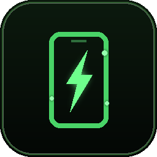

<div align="center">



# THE DAWG // APK FORGE

### Describe an Android app. Get a real `.apk`.

A local AI app-smith. It forges a polished single-file Kivy app, tears it apart looking for
the reasons Android apps fail to launch, **actually runs it and taps every button**, fixes
what it finds — then compiles a real APK with Buildozer.

No cloud IDE. No Android Studio. Your machine, your key, your APK.

<br>


</div>

<br>

```
  "a dark pomodoro timer with a countdown ring"
                    │
                    ▼
   FORGE ──▶ REPAIR ──▶ LINT ──▶ SELF-TEST ──▶ BUILD ──▶  your-app.apk
     │        0 tok     0 tok     real Kivy     buildozer
     │          ▲                     │
     └──────────┴───── AI FIX ◀───────┘
                 only when free repair can't
```

<br>

<div align="center">

| | |
|:--|:--|
| 🧠 **Forge** | Describe it in a sentence. Get a complete, styled, single-file Kivy app. |
| 🔍 **Lint** | 20+ static checks for the things that only break *on device*. Live as you type. |
| 🔧 **Repair** | Deterministic fixes for the common faults. **Costs nothing.** |
| 🧪 **Self-test** | 10 phases on a virtual display — including pressing every button. |
| 🔁 **Verify** | One button runs the whole loop until it passes, then stops. |
| 📦 **Build** | Streams the Buildozer log, hands you the `.apk`. |
| 💰 **Meter** | Live token counter and a hard session budget. Nothing runs away. |

</div>

---

## Quick start

```bash
curl -fsSL https://raw.githubusercontent.com/the-priest/androdawg/main/install.sh | bash
androdawg
```

Add your SiliconFlow key in **Settings (⚙)**, type what you want, hit **Forge & verify**.

---

## Why v3 exists

**v2 was lying to the model.**

Its system prompt advertised a UI kit that did not exist. It told the AI to use `Theme.BG`,
`Theme.TXT`, `Theme.ACCENT2`, `Theme.GOOD`, `Theme.BAD` and `IconButton(glyph=)` — while the
kit actually shipped `Theme.bg`, `Theme.text`, `Theme.accent`, `Theme.ok`, `Theme.danger`
and `IconButton(text=)`.

So every forged app that touched the theme was an `AttributeError` waiting to happen. And you
found out **forty minutes into a Buildozer run**. The bundled game template had the same bug.

v3 fixes it at the root: the prompt's API reference is now **generated from the kit's own AST
at import time**, and a test asserts every name it mentions really exists in the kit source.
The prompt and the kit can no longer drift apart.

Then v3 assumes the model *will still* make mistakes, and puts three nets under it — a static
analyser that understands the kit, a deterministic repair pass that costs nothing, and a
self-test that launches the app for real and presses its buttons.

---

## Install

```bash
curl -fsSL https://raw.githubusercontent.com/the-priest/androdawg/main/install.sh | bash
```

One paste, does everything:

- wipes any previous install (**keeps your saved API key**)
- installs system deps and sets up **JDK 17** via Temurin — Kali has no `openjdk-17` package
- installs buildozer + cython into your user site
- best-effort installs **xvfb + host Kivy** so the self-test works
- pulls `apkforge.py` + `icon.png`
- drops a clickable app-menu entry wired to its own panel icon

Re-running it is a clean reinstall.

**Run it:** click *The Dawg APK Forge* in your app menu, or type `androdawg`.

It opens in its own app window (Brave/Chromium `--app` mode — not a browser tab) under its
own taskbar entry with its own icon. Single-instance: launching again focuses the running
window. Set `DAWG_BROWSER` to force a specific binary. Projects and built APKs land in
`~/AndroDawg/projects`.

### Keys

Set them in **Settings (⚙)** inside the app, or via env:

```bash
export SILICONFLOW_API_KEY=sk-...
export GROQ_API_KEY=gsk_...
```

Settings-panel keys persist to `~/.androdawg/config.json` (chmod 600) and take effect
immediately — no restart. Stored keys beat env. **SiliconFlow is primary, Groq is the
fallback.** Model and base URL are changeable in the same panel.

---

## Two ways in

<table>
<tr>
<td width="50%" valign="top">

### ⚡ AI FORGE

Describe the app. The model writes a complete single-file Kivy app on top of the built-in UI
kit, declares its own requirements, permissions and orientation, and may set safe build
options inside guardrails.

Quick-refine chips are one click: *polish look*, *add sound*, *add settings*, *add scores*,
*theme toggle*.

**Forge & verify** runs the entire loop unattended — forge → free repair → static gate →
self-test → targeted fix → repeat — until it passes or hits a stop condition.

</td>
<td width="50%" valign="top">

### ✎ MANUAL

Opens a **genuinely empty file**. No kit, no scaffold, nothing to delete before you start.

Add the UI kit with one button if you want it. Or drop in a starter: *minimal Kivy*, *kit
starter*, *form + list*, *game loop*.

You can still hand-write a full raw `buildozer.spec`. Same validate → self-test → build
pipeline either way, and the same free repair pass.

</td>
</tr>
</table>

---

## What stops your APKs failing to launch

### 1 · Static analysis — live, as you type, free

Errors block the build outright. Warnings and info are advisory. Every finding carries a fix hint.

| Check | Why it matters |
|---|---|
| **Wrong `Theme.` attribute** | The #1 v2 crash. Names the correct spelling. |
| **Fake kit keyword** | `IconButton(glyph=)` → `TypeError` on construction. Names the real one. |
| **Undefined names** | Catches invented widgets and plain typos before they `NameError` on device. |
| **Non-Kivy toolkits** | tkinter / PyQt / PySide / GTK / wx / curses never survive python-for-android. |
| **Undeclared recipe import** | `import requests` without it in `requirements` → guaranteed `ImportError`. |
| **Unguarded android-only import** | Needs an `if platform == "android":` guard or it kills desktop too. |
| **External `.kv` load** | The APK is built from a single `main.py`. |
| **`os.system` / `subprocess`** | There is no shell on Android. |
| **`time.sleep` on the UI thread** | Freezes the app; Android shows an ANR. |
| **`__init__` not chaining `super()`** | Silently breaks `size_hint` / `pos_hint` layout. |
| **Threads touching widgets** | Corrupts the render and crashes on device. |
| **`schedule_interval(…, 0)`** | Uncapped every-frame loop: battery drain and jank. |
| **Relative file writes** | Android sandboxes the cwd — paths must go through `user_data_dir`. |
| **Network without `INTERNET`** | Requests fail silently on device. |
| **Missing assets · `input()` · `Window.size` · mutable defaults · bare `except:`** | The usual quiet killers. |

### 2 · Repair free — deterministic fixes, **zero tokens**

Runs *before* any model call, so the expensive part is only asked about problems that code
genuinely can't solve on its own. An actual run against five seeded bugs:

```
* Theme.TXT -> Theme.text
* IconButton(glyph=) -> IconButton(text=) x1
* removed 1 Window.size/fullscreen assignment (Buildozer owns sizing)
* added 'requests' to requirements (imported as requests)
* added INTERNET permission (the app makes network calls)

remaining issues: (none)          tokens spent: 0
```

It also re-attaches a missing `.run()` entry point, and it's idempotent — running it again on
clean code changes nothing.

### 3 · Self-test — it actually runs the thing

v2 ran the app for two seconds and called that a pass. v3 drives **ten phases** on a virtual
display and reports each one separately:

| # | Phase | What it proves |
|:--|:--|:--|
| 1 | `compile` | The file is valid Python. |
| 2 | `import` | Module-level code doesn't explode. |
| 3 | `instantiate` | The `App` subclass constructs. |
| 4 | `build` | `build()` returns a root widget. |
| 5 | `widget_tree` | Reports widget count and tree depth. |
| 6 | `render` | Four real frames get drawn. |
| 7 | **`touch`** | **Every button in the tree is pressed.** |
| 8 | `rotate` | Survives a portrait ↔ landscape flip. |
| 9 | `soak` | 3 seconds of frames; catches exceptions thrown from timers and callbacks. |
| 10 | `teardown` | `on_stop` runs clean. |

**Phase 7 is the one that earns its keep.** An app whose handler references an attribute that
was never assigned passes v2 and fails v3:

```
✓ compile   ✓ import   ✓ instantiate   ✓ build   ✓ widget_tree   ✓ render
✗ touch     1/1 handlers raised — PillButton (label 'TAP'):
            self.counter.text = "hit"        ← AttributeError
✓ rotate    ✓ soak     ✓ teardown
```

The real traceback feeds straight into **Auto-fix**. No host Kivy? It reports *skipped* and
the build still works — static analysis still gates it.

---

## Token spend: visible, capped, and mostly avoided

The UI kit is 305 lines. **v2 sent it to the model on every fix and polish — and had the
model echo the whole thing back.** Measured waste: **~2,938 tokens each way, every round.**

| | v2 | v3 |
|:--|:--|:--|
| Kit in AI calls | sent **and** echoed back | **stripped**, re-attached server-side |
| Follow-up context | replayed every previous full app | short user turns + current code, once |
| Repeat requests | billed every time | **served from disk cache, free** |
| Common mistakes | a paid fix round | **repaired locally, 0 tokens** |
| `max_tokens` | 16,000 | 12,000, configurable |
| Fix temperature | 0.4 | 0.15 — a fix stays a fix, not a rewrite |
| Spend visibility | none | live meter + hard session budget |

The header carries a running token count. **Settings → Token spend** exposes a hard session
budget, per-call `max_tokens`, the auto-fix round count, and toggles for the response cache
and local repair.

**Forge & verify refuses to run away with your key.** It stops when it runs out of rounds,
when the budget is spent, or when the model returns identical code twice.

Measured, end to end, on a genuinely broken app:

```
FINAL STATUS : done            MODEL CALLS : 2
chars per call: [5386, 3920]   ← the 12 KB kit never crossed the wire
```

---

## Why the apps don't look like default-Kivy grey

Every forged app gets a small, battle-tested **UI kit** prepended — pure Kivy, no external
deps, so it always survives python-for-android:

<div align="center">

`Theme` · `GradientBackground` · `AppBar` · `Card` · `PillButton` · `IconButton`
`TextField` · `Divider` · `heading()` · `body()` · `toast()`

</div>

`Theme.seed("Your App")` derives a unique primary/accent colour from the app's own name, so
two apps never look identical. The model builds its screens out of these instead of raw grey
widgets.

You still see the **full assembled file** in the editor — nothing is hidden — and the kit's
line numbers are dimmed in the gutter so it's always obvious which code is yours.

It also generates a real **launcher icon and presplash** in pure Python (no PIL) and wires
`android.presplash_color`, so there's **no white flash on launch**.

---

## Build config

The AI may only set **whitelisted, value-validated** spec keys: `orientation`, `fullscreen`,
`api` (24–35), `minapi` (21–30), `wakelock`, `presplash_color`. Anything else it tries is
dropped with a warning, so a bad model response can't brick a 40-minute build. In manual mode
you own the whole spec.

- Default arch is **arm64-v8a** — every modern phone, and it halves build time. Tick
  `armeabi-v7a` in the advanced panel if you need 32-bit as well.
- `android.api 34` / `android.minapi 24` by default.

Hard blockers refuse the build outright: syntax errors, non-Kivy GUI toolkits, and buildozer
missing from PATH. A wrong JDK is caught in preflight instead of dying at the Gradle step.

---

## Suggested flow

1. **Check the environment pill** in the header — buildozer, java, keys, cache, and whether
   self-test is available.
2. **Smoke test once.** A built-in, guaranteed-buildable app. Build it to prove your
   toolchain works end to end *before* you start trusting AI output.
3. **Forge & verify** a description — or switch to **MANUAL** and start from an empty file.
4. **Repair free** first, **Auto-fix** for what's left, **Polish** for looks. **Self-test**
   to confirm it launches and survives taps.
5. **Build APK** → streams the Buildozer log → **Download APK**. Or **Download project
   (.zip)** to get `main.py` + `buildozer.spec` + generated icon/presplash and build it
   anywhere.

---

## HTTP API

Everything the UI does is a plain endpoint on `127.0.0.1:8731`. Fully scriptable.

| Method | Route | Does |
|:--|:--|:--|
| `POST` | `/api/forge` | Generate an app from a description |
| `POST` | `/api/autoforge` | Run the full forge → verify → fix loop as a background job |
| `GET` | `/api/job?id=` | Poll a job — steps, phases, current payload |
| `POST` | `/api/lint` | Static analysis only. Instant, free |
| `POST` | `/api/repair` | Deterministic local fixes. Free |
| `POST` | `/api/fix` | Targeted AI fix from an error or traceback |
| `POST` | `/api/polish` | AI restyle pass |
| `POST` | `/api/testrun` → `GET /api/testlog?id=` | Run the 10-phase self-test |
| `POST` | `/api/build` → `GET /api/log?id=` → `GET /api/apk?id=` | Build and fetch the APK |
| `POST` | `/api/manual` | Wrap hand-written code, with or without the kit |
| `POST` | `/api/project_zip` | Buildozer-ready project archive |
| `GET` | `/api/usage` | Token spend, budget, remaining |
| `GET` `POST` | `/api/config` | Keys, model, endpoints, efficiency knobs |
| `GET` | `/api/doctor` · `/api/templates` · `/api/template?id=` · `/api/smoketest` · `/api/ping` | Environment and starters |
| `POST` | `/api/cache_clear` · `/api/quit` | Housekeeping |

---

## Test it yourself

```bash
python3 selftest.py
```

**334 assertions, all green.** No API key, no Android toolchain needed — the AI and buildozer
are both mocked.

<details>
<summary><b>What the suite covers</b></summary>

<br>

- **Parser / validator** — adversarial model output, plus a **200,000-iteration fuzz** for
  determinism and no-crash behaviour.
- **Kit API contract** — every `Theme.` attribute the prompt advertises must exist in the kit
  source; the v2 ghosts (`Theme.BG`, `IconButton(glyph=)`) must be gone; every shipped
  template must parse and analyse clean.
- **Static analysis** — each check fires on a seeded bug *and stays quiet on healthy code*.
  False positives are treated as failures.
- **Auto-repair** — fixes applied, idempotent on a second pass, and asserted to spend
  **exactly zero tokens**.
- **Token discipline** — kit stripping round-trips losslessly, saves >1000 tokens per call,
  metering accumulates correctly, and the budget guard actually refuses.
- **Full HTTP pipeline** — mocked AI + mocked buildozer, build-refusal paths, malformed
  bodies, unknown routes, settings clamping, and key handling that never leaks a raw key.
- **v3 endpoints** — including a check that the UI actually wires up every route it calls.

Pass a smaller fuzz count to go faster:

```bash
python3 selftest.py 1000
```

</details>

---

## Notes & gotchas

- Only **Kivy** survives the python-for-android pipeline. Generated apps are Kivy, always.
- The first build downloads the Android SDK/NDK (~20–40 min). `~/.buildozer` caches it, so
  later builds are minutes.
- **JDK 17–24 required.** Buildozer's bundled Gradle can't run on JDK 25+ (Kali's default) —
  it dies on class file major 69. The app points `JAVA_HOME` at a compatible JDK
  automatically when one is installed, and refuses the build early with instructions when
  it isn't.
- Traceback line numbers refer to the **full** file. The kit is 305 lines, so subtract that
  to find the line in your own code. The gutter dims the kit range to make this obvious.
- The self-test needs host Kivy + xvfb. Without them it reports *skipped*; static analysis
  still gates the build.
- The whole server is **Python stdlib only**. The only third-party things involved are
  buildozer (for building) and Kivy (for testing) — neither is needed to run the tool itself.

---

<div align="center">

<br>

**MIT** — do what you like with it.

Built by [**the-priest**](https://github.com/the-priest)

</div>
